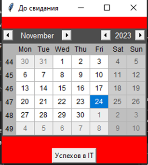

# Работа с временем и датами

Одним из важных аспектов при разработке программного обеспечения является оптимизация производительности. 

Оценка времени выполнения кода играет важную роль в определении эффективности алгоритмов и выявлении мест, где можно улучшить скорость работы программы. Одним из способов данной оценки является модуль time. Модуль time предоставляет функции для работы со временем в Python. 

Одна из таких функций — time.time(), которая возвращает количество секунд, прошедших с начала эпохи (обычно 1 января 1970 года). 

Можно использовать эту функцию для измерения времени выполнения определенного участка кода.

```python
import time

start = time.time()
x = [i for i in range(10_000_000)] # Как называется эта синтаксическая структура
end = time.time()
print(end - start)
```


```python
start = time.time()
x = (i for i in range(10_000_000)) # что возвращает эта строчка 
end = time.time()
print(end - start)
```


```python
start = time.time()
x = {i for i in range(10_000_000)} # что возвращает эта строка 
end = time.time()
print(end - start)
```

```python
start = time.time()
x = {i:i**2 for i in range(10_000_000)} # что возвращает эта строка 
end = time.time()
print(end - start)
```


```python
start = time.time()
x = range(10_000_000) # что возвращает эта строка 
end = time.time()
print(end - start)
```

Изучая сложность времени, вы поймете важную концепцию эффективности и сможете найти узкие места в вашем коде, которые следует улучшить, главным образом при работе с огромными наборами данных.

# Модуль `timeit` 

Предназначен специально для измерения времени выполнения небольших фрагментов кода.

Он предоставляет функцию timeit(), которая автоматически повторяет выполнение кода несколько раз и возвращает среднее время выполнения:

```python
from  timeit import timeit

t = timeit('print("Hello from Russia")')
print(t)

```

миллион раз выполнит функцию print

или

```python
t = timeit('"-".join(str(n) for n in range(100))', number=10000)
print(t)
```


> Пример с последовательностью Фибоначи

```python
from timeit import Timer

def get_fib_recurs(n):
    if n == 1 or n == 2:
        return 1
    else:
        return get_fib(n - 1) + get_fib(n - 2)


def get_fib(n):
    a, b = 1, 1
    i = 2
    while i < n:
        a, b = b, a + b
        i += 1
    return b

t = Timer('get_fib(20000)', "from __main__ import get_fib")
print(t.timeit(number=200))

t = Timer('get_fib_recurs(20000)', "from __main__ import get_fib_recurs")
print(t.timeit(number=200))

```


## Работа с датами на примере работы модуля `datetime`

Основной функционал для работы с датами и временем сосредоточен в модуле datetime в виде следующих классов:

* date
* time
* datetime

### Класс date

Для работы с датами воспользуемся классом `date`, который определен в модуле `datetime`.

 Для создания объекта `date` мы можем использовать конструктор `date`, который последовательно принимает три параметра: год, месяц и день.
date(year, month, day)

Например, создадим какую-либо дату :

```python
import datetime
 
yesterday = datetime.date(2024,5, 2)
print(yesterday)      # 2024-05-02

```
Если необходимо получить текущую дату, то можно воспользоваться методом today():
```python
from datetime import date
 
today = date.today()
print(today)      # 2017-05-03
print("{}.{}.{}".format(today.day, today.month, today.year))      # 2.5.2017
```

С помощью свойств day, month, year можно получить соответственно день, месяц и год

### Класс `datetime`

Класс `datetime` из одноименного модуля объединяет возможности работы с датой и временем.
Для создания объекта `datetime` можно использовать следующий конструктор:

```python
datetime(year, month, day [, hour] [, min] [, sec] [, microsec])
```

Первые три параметра, представляющие год, месяц и день, являются обязательными. Остальные необязательные, и если мы не укажем для них значения, то по умолчанию они инициализируются нулем.

```python
from datetime import datetime
 
deadline = datetime(2023, 5, 10)
print(deadline)  # 2023-05-10 00:00:00

deadline = datetime(2023, 5, 10, 4, 30)
print(deadline)  # 2023-05-10 04:30:00
```
Для получения текущих даты и времени можно вызвать метод now():

```python
now = datetime.now()
print(now)

print(f"{now.day}.{now.month}.{now.year}  {now.year}:{now.minute}")
 
print(now.date())
print(now.time())
```

С помощью свойств `day, month, year, hour, minute, second` можно получить отдельные значения даты и времени. 

А через методы date() и time() можно получить отдельно дату и время соответственно.

```python
from datetime import datetime

birthday = datetime(2008, 12, 18)
date_now = datetime.now()

age = date_now - birthday
sec = age.total_seconds()

min, _ = divmod(sec, 60)
print(min, 'мин')

hours, _ = divmod(min, 60)
print(hours, 'часов')

days, _ = divmod(hours, 24)
print(days, 'дней')

years, days = divmod(days, 365)
print(years, 'лет', days, 'дней')
``` 
Результат в консоли:


```
23633263.0 мин
393887.0 часов
16411.0 дней
44.0 лет 351.0 дней

Или age = date_now - birthday
print(age.days//365)


yesterday = datetime.date(2023, 12, 31)
print(yesterday) 
```

Если необходимо получить текущую дату, то можно воспользоваться методом `today()`:

```python
from datetime import datetime

birthday = date(1978, 12, 18)

print(date_now.year)
print(date_now.month)
print(date_now.day)


birthday = date(1978, 12, 18)

print(birthday.year)
print(birthday.month)
print(birthday.day)


date_now = date.today()
```
С помощью свойств day, month, year можно получить соответственно день, месяц и год
Из секунд получить дату, время

```python
t0 = time.time()
print(t0)
print(datetime.fromtimestamp(t0))
```

### Класс `time`

За работу с временем отвечает класс time. Используя его конструктор, можно создать объект времени:
```
time([hour] [, min] [, sec] [, microsec])
```
Конструктор последовательно принимает часы, минуты, секунды и микросекунды. Все параметры необязательные, и если мы какой-то параметр не передадим, то соответствующее значение будет инициализироваться нулем.

```python
from datetime import time

current_time = time()
print(current_time)  # 00:00:00

current_time = time(16, 25)
print(current_time)  # 16:25:00

current_time = time(16, 25, 45)
print(current_time)  # 16:25:45
```


### Преобразование из строки в дату

Из функциональности класса datetime следует отметить метод strptime(), который позволяет распарсить строку и преобразовать ее в дату. Этот метод принимает два параметра:
```
strptime(str, format)
```
Первый параметр str представляет строковое определение даты и времени, а второй параметр - формат, который определяет, как различные части даты и времени расположены в этой строке.

Для определения формата мы можем использовать следующие коды:

* %d: день месяца в виде числа
* %m: порядковый номер месяца
* %y: год в виде 2-х чисел
* %Y: год в виде 4-х чисел
* %H: час в 24-х часовом формате
* %M: минута
* %S: секунда

Применим различные форматы:

```python
deadline = datetime.strptime("22/05/2024", "%d/%m/%Y")
print(deadline)     

deadline = datetime.strptime("22/05/2025 12:30", "%d/%m/%Y %H:%M")
print(deadline)

deadline = datetime.strptime("05-22-2026 12:30", "%m-%d-%Y %H:%M")
print(deadline)
```
### Фоматирование дат и времени

Для форматирования объектов date и time в обоих этих классах предусмотрен метод strftime(format). Этот метод принимает только один параметр, указывающий на формат, в который нужно преобразовать дату или время.

Для определения формата мы можем использовать один из следующих кодов форматирования:

* %a: аббревиатура дня недели. Например, Wed - от слова Wednesday (по умолчанию используются английские наименования)
* %A: день недели полностью, например, Wednesday
* %b: аббревиатура названия месяца. Например, Oct (сокращение от October)
* %B: название месяца полностью, например, October
* %d: день месяца, дополненный нулем, например, 01
* %m: номер месяца, дополненный нулем, например, 05
* %y: год в виде 2-х чисел
* %Y: год в виде 4-х чисел
* %H: час в 24-х часовом формате, например, 13
* %I: час в 12-ти часовом формате, например, 01
* %M: минута
* %S: секунда
* %f: микросекунда
* %p: указатель AM/PM
* %c: дата и время, отформатированные под текущую локаль
* %x: дата, отформатированная под текущую локаль

* %X: время, форматированное под текущую локаль

Используем различные форматы:

```python
now = datetime.now()
print(now.strftime("%Y-%m-%d"))             
print(now.strftime("%d/%m/%Y"))             
print(now.strftime("%d/%m/%y"))             
print(now.strftime("%d %B %Y (%A)"))       
print(now.strftime("%d/%m/%y %I:%M")) 
```

При выводе названий месяцев и дней недели по умолчанию используются английские наименования. Если мы хотим использовать текущую локаль, то мы можем ее предварительно установить с помощью модуля `locale`:
```python
import locale

locale.setlocale(locale.LC_ALL, "")

now = datetime.now()
print(now.strftime("%d %B %Y (%A)"))  
```


## Сложение и вычитание дат и времени

Нередко при работе с датами возникает необходимость добавить к какой-либо дате определенный промежуток времени или, наоборот, вычесть некоторый период. И специально для таких операций в модуле datetime определен класс timedelta. 

Фактически этот класс определяет некоторый период времени.

Для определения промежутка времени можно использовать конструктор `timedelta`:

```
timedelta([days] [, seconds] [, microseconds] [, milliseconds] [, minutes] [, hours] [, weeks])
```
В конструктор мы последовательно передаем дни, секунды, микросекунды, миллисекунды, минуты, часы и недели.

Определим несколько периодов:
```python
three_hours = timedelta(hours=3)
print(three_hours)  # 3:00:00
three_hours_thirty_minutes = timedelta(hours=3, minutes=30)  # 3:30:00

two_days = timedelta(2)  # 2 days, 0:00:00
print(two_days)

two_days_three_hours_thirty_minutes = timedelta(days=2, hours=3, minutes=30)  # 2 days, 3:30:00
print(two_days_three_hours_thirty_minutes)
```

Используя `timedelta`, мы можем складывать или вычитать даты. Например, получим дату, которая будет через два дня:

```python
now = datetime.now()
print(now)
two_days = timedelta(2)
in_two_days = now + two_days
print(in_two_days) 
```

Или узнаем, сколько было времени 10 часов 15 минут назад, то есть фактически нам надо вычесть из текущего времени 10 часов и 15 минут:
```python

from datetime import timedelta, datetime
 
now = datetime.now()
till_ten_hours_fifteen_minutes = now - timedelta(hours=10, minutes=15)
print(till_ten_hours_fifteen_minutes) 
```

### Свойства `timedelta`

Класс timedelta имеет несколько свойств, с помощью которых мы можем получить временной промежуток:

days: возвращает количество дней
seconds: возвращает количество секунд
microseconds: возвращает количество микросекунд

Кроме того, метод `total_seconds()` возвращает общее количество секунд, куда входят и дни, и собственно секунды, и микросекунды.

Например, узнаем какой временной период между двумя датами:

```python
from datetime import timedelta, datetime
 
now = datetime.now()
twenty_two_may = datetime(2017, 5, 22)
period = twenty_two_may - now
print("{} дней  {} секунд   {} микросекунд".format(period.days, period.seconds, period.microseconds))
# 18 дней  17537 секунд   72765 микросекунд
 
print("Всего: {} секунд".format(period.total_seconds()))
# Всего: 1572737.072765 секунд
```

## Сравнение дат

Также как и строки и числа, даты можно сравнивать с помощью стандартных операторов сравнения:

```python
from datetime import datetime
 
now = datetime.now()
deadline = datetime(2017, 5, 22)
if now > deadline:
    print("Срок сдачи проекта прошел")
elif now.day == deadline.day and now.month == deadline.month and now.year == deadline.year:
    print("Срок сдачи проекта сегодня")
else:
    period = deadline - now
    print("Осталось {} дней".format(period.days))
```

### Модули `сalendar` и `tkcalendar`


Пример
```python
import calendar
print(calendar.month(2023, 7))

Мы можем распечатать календарь на целый год, используя следующую функцию: calendar.calendar(yyyy, w, l, c, m)
calendar.isleap(2016)
calendar.leapdays(year1, year2)
```

Возврат дня недели
Метод буднего дня принимает 3 аргумента, а именно: год, месяц и день. 

Функция возвращает день недели, при этом понедельник имеет индекс 0, а воскресенье – 6. 
Например: 
```python
calendar.weekday(2019, 3, 21) # Вывод: 3
```
  
Как видно, эта функция возвращает значение индекса «3», то есть «четверг». 

Получение сокращенных названий дней недели 
Функция `weekheader` принимает аргумент n, который указывает количество символов для определенного имени дня недели и возвращает заголовок, содержащий сокращенные имена дней недели. 
Например:
```python
 print (calendar.weekheader(2)) # Вывод: Mo Tu We Th Fr Sa Su 
```
По аналогии:
```python
print (calendar.weekheader(3))  # Вывод: Mon Tue Wed Thu Fri Sat Sun 
```

Получение количества дней в месяце

Функция `monthrange` принимает 2 аргумента: год и месяц. 

Эта функция возвращает кортеж, содержащий индекс дня недели, в который начинается месяц, и количество дней в месяце. 
Например: 

```python
print (calendar.monthrange(1983, 12)) Вывод: {3,31}
```

Поскольку первый день декабря 1983 г. был четвергом, функция возвращает значение индекса четверга в качестве первого элемента кортежа и 31, поскольку это количество дней в декабре. 

Получение недели в месяце 

Функция `monthcalendar` принимает 2 аргумента: год и месяц и возвращает матрицу, в которой каждая строка представляет неделю в этом месяце. 

Например:

```python
 print(calendar.monthcalendar(1983, 11))
```

Python предлагает несколько вариантов разработки GUI (графического пользовательского интерфейса). 

Из всех методов графического интерфейса чаще всего используется Tkinter. 

Это стандартный интерфейс Python для инструментария Tk GUI, поставляемого с Python. 

Python с Tkinter — это самый быстрый и простой способ создания приложений с графическим интерфейсом.

Посмотрим, как мы можем создать калькулятор дней с даты в Tkinter, калькулятор дней с даты используется для добавления или вычитания дней из выбранной даты, чтобы получить новую дату. 


Этот калькулятор используется для получения точной даты, которая наступит через заданное количество дней. 
```python
from tkinter import *
from tkcalendar import Calendar


def click():
    root.title("До свидания")
    root["bg"] = "red"
    btn["text"] = "Успехов в IT"


root = Tk()
cal = Calendar(root)
cal.pack(pady=20)

btn = Button(text="Button", command=click)
btn.pack()

root.mainloop()

```




